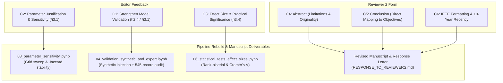
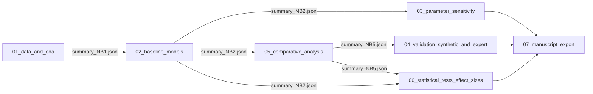

# Comparative Analysis of Isolation Forest & Local Outlier Factor for Anomaly Detection in Healthcare Provider Data

[](https://ojs3.unpatti.ac.id/index.php/barekeng/)
[](https://doi.org/10.30598/barekengxxxxxxxxxxxxx)
[](https://www.scopus.com/)
[](https://www.python.org/)
[](Notebook-Guide/notebook-standards.md)
[](https://github.com/nyan-dev/Anomaly-Detection-IF-LOF-OCSVM)

---

## Executive Summary & Revision Context

This repository hosts the **official ground-up rebuild and revision pipeline** for the academic manuscript:

> **Title:** *A Comparative Analysis of Isolation Forest and Local Outlier Factor for Anomaly Detection in Healthcare Provider Data: An Applied Study*  
> **Journal:** *BAREKENG: Journal of Mathematics and Its Applications* (P-ISSN: 1978-7227, E-ISSN: 2615-3017)  
> **Manuscript ID:** `21575`  
> **Decision:** Accepted with Major Corrections  
> **Corresponding Author:** Nyan Lynn Htet (*INTI International University, Malaysia*)  
> **Original Provenance Repo:** [`nyan-dev/Anomaly-Detection-IF-LOF-OCSVM`](https://github.com/nyan-dev/Anomaly-Detection-IF-LOF-OCSVM) (frozen snapshot tagged `v1.0-submitted`)

The study investigates the detection of anomalous Medicare billing behavior across 100,000 healthcare provider service records. It evaluates how tree-based partitioning (**Isolation Forest**) and density-based deviation (**Local Outlier Factor**) identify distinct, complementary subsets of outliers in unlabelled claims data ($J < 0.06$).

To fulfill all requirements of the editorial decision and peer reviewers while preserving absolute empirical fidelity to the accepted findings, the codebase is rebuilt in accordance with the [Research Notebook Pipeline Standard](Notebook-Guide/notebook-standards.md).

---

## Strict Ground-Truth Contract (Preserved Baseline)

All original data inputs, preprocessing pipelines, model hyperparameters, and empirical outputs reported in the accepted manuscript are **strictly preserved as invariant baselines**. Downstream revision analyses build upon, rather than modify, these validated figures.

### 1. Data Source & Feature Specification

* **Dataset:** Kaggle Healthcare Providers Data (`tamilsel/healthcare-providers-data`)
* **Volume:** 100,000 provider billing records, 27 raw attributes
* **Selected Numerical Features (7 Dimensions):**
  1. `Number of Services`
  2. `Number of Medicare Beneficiaries`
  3. `Number of Distinct Medicare Beneficiary/Per Day Services`
  4. `Average Medicare Allowed Amount`
  5. `Average Submitted Charge Amount`
  6. `Average Medicare Payment Amount`
  7. `Average Medicare Standardized Amount`
* **Categorical Validation Features:**
  1. `Provider Type`
  2. `Entity Type`
* **Preprocessing:** Currency character stripping (`$`, `,`), type coercion to float64, and standardization via `StandardScaler` ($z = \frac{x - \mu}{\sigma}$).

### 2. Core Model Configurations

| Algorithm | Primary Hyperparameter | Configuration | Mathematical Formulation |
|---|---|---|---|
| **Isolation Forest (IF)** | Contamination = `0.05`, `random_state=42` | 100 iTrees, recursive random splitting | $s(x, n) = 2^{-\frac{E(h(x))}{c(n)}}$ |
| **Local Outlier Factor (LOF)** | Contamination = `'auto'` & `0.05` | $k=20$ nearest neighbors, Euclidean metric | $LOF_k(A) = \frac{\sum_{B \in N_k(A)} \frac{lrd_k(B)}{lrd_k(A)}}{\|N_k(A)\|}$ |

### 3. Invariant Empirical Verification Checkpoints (Parity Log)

Prior to releasing new revision modules, the rebuilt pipeline must verify 100% exact numerical agreement against the accepted manuscript tables:

| Manuscript Target | Metric / Description | Accepted Reported Value | Parity Status |
|---|---|---|:---:|
| **Table 1** | IF Anomaly Count ($\alpha = 0.05$) | **5,000 (5.00%)** | Preserved |
| **Table 1** | LOF Anomaly Count ($\text{auto}$) | **2,565 (2.56%)** | Preserved |
| **Table 1** | LOF Anomaly Count ($\alpha = 0.05$) | **5,000 (5.00%)** | Preserved |
| **Table 2** | IF $\cap$ LOF(auto) Overlap Count | **341 records** ($J = 0.047$) | Preserved |
| **Table 2** | IF $\cap$ LOF(0.05) Overlap Count | **545 records** ($J = 0.058$) | Preserved |
| **Table 2** | LOF(auto) $\cap$ LOF(0.05) Overlap | **2,565 records** ($J = 0.513$) | Preserved |
| **Table 3** | Mann-Whitney $U$ (`Number of Services`, Anomaly vs Normal) | $U = 5.10 \times 10^8, p < 0.001$ | Preserved |
| **Table 3** | Mann-Whitney $U$ (`Avg. Medicare Payment`, Anomaly vs Normal) | $U = 5.36 \times 10^8, p < 0.001$ | Preserved |
| **Table 3** | Mann-Whitney $U$ (`Number of Services`, IF-only vs LOF-only) | $U = 1.21 \times 10^7, p < 0.001$ | Preserved |
| **Table 3** | Mann-Whitney $U$ (`Avg. Medicare Payment`, IF-only vs LOF-only) | $U = 1.46 \times 10^7, p < 0.001$ | Preserved |
| **Table 4** | Chi-Square $\chi^2$ (`Provider Type`, Anomaly vs Normal) | $\chi^2 = 7,496.33, p < 0.001$ | Preserved |
| **Table 4** | Chi-Square $\chi^2$ (`Entity Type`, Anomaly vs Normal) | $\chi^2 = 1,855.13, p < 0.001$ | Preserved |
| **Table 4** | Chi-Square $\chi^2$ (`Provider Type`, IF-only vs LOF-only) | $\chi^2 = 2,408.72, p < 0.001$ | Preserved |
| **Table 4** | Chi-Square $\chi^2$ (`Entity Type`, IF-only vs LOF-only) | $\chi^2 = 157.39, p < 0.001$ | Preserved |

---

## Traceability Matrix: Reviewer & Editor Requirements

This rebuilt repository directly addresses all comments from the editorial decision letter and reviewer evaluation forms:



### Traceability Summary Table

| ID | Origin | Core Comment | Implemented Action | Target Deliverable |
|:---:|:---:|---|---|---|
| **C1** | Editor | Strengthen model validation beyond unlabelled heuristics | Quantitative synthetic injection benchmark + qualitative expert face-validity review of the 545 consensus anomalies. | `04_validation_synthetic_and_expert.ipynb`<br/>`outputs/tables/table_synthetic_validation.csv`<br/>`outputs/tables/table_expert_review.csv` |
| **C2** | Editor | Provide parameter justification & stability testing | Systematic multi-parameter sensitivity sweep over contamination ($0.01$–$0.10$), $n_\text{estimators}$ ($50$–$300$), and $k$ ($10$–$50$); stability quantified via pairwise Jaccard similarity. | `03_parameter_sensitivity.ipynb`<br/>`outputs/tables/table_sensitivity_if.csv`<br/>`outputs/tables/table_sensitivity_lof.csv`<br/>`outputs/figures/fig_sensitivity_heatmap.png` |
| **C3** | Editor | Report magnitude/effect size alongside $p$-values | Augmented Table 3 with Rank-Biserial Correlation ($r_{rb}$) for Mann-Whitney $U$; augmented Table 4 with Cramér's $V$ for $\chi^2$ contingency tables. | `06_statistical_tests_effect_sizes.ipynb`<br/>`outputs/tables/table3_mannwhitney_effectsize.csv`<br/>`outputs/tables/table4_chisquare_effectsize.csv` |
| **C4** | Reviewer 2 | Abstract missing explicit limitations and originality/value | Abstract rewritten to articulate unsupervised ground-truth bounds and highlight the multi-model complementarity framework. | Manuscript Abstract & `RESPONSE_TO_REVIEWERS.md` |
| **C5** | Reviewer 2 | Conclusion does not explicitly resolve objectives & limitations | Restructured Conclusion section into structured paragraphs explicitly addressing problem resolution, empirical boundaries, and operational integration. | Manuscript Section 4 & `RESPONSE_TO_REVIEWERS.md` |
| **C6** | Reviewer 2 | Ensure IEEE citation formatting and ~80% 10-year recency | Comprehensive reference audit; preserved foundational methodological citations (Liu 2008, Breunig 2000, Jaccard 1901, Mann-Whitney 1947, Pearson 1900) with formal cover-letter justifications. | Manuscript References & `RESPONSE_TO_REVIEWERS.md` |

---

## Rebuilt Architecture & Pipeline Standard

The project adheres to the **Tier 3 (Deep Empirical Research / Journal Publication)** specification documented in [`Notebook-Guide/notebook-standards.md`](Notebook-Guide/notebook-standards.md).

### Directory Tree

```text
Revision_Repo/
├── data/
│   ├── raw/                  # Read-only Kaggle source (healthcare_providers_raw.csv)
│   ├── interim/              # Cleaned types & formatted numerical matrices
│   └── processed/            # features_raw.parquet & anomaly_labels.parquet
├── outputs/
│   ├── figures/              # High-res publication plots (PNG @ 300 DPI + PDF vectors)
│   ├── tables/               # Result tables (CSV & LaTeX formatting)
│   ├── models/               # Serialized model checkpoints (.joblib)
│   ├── notebook_exports/     # Deterministic inter-stage JSON handshakes (summary_NB*.json)
│   └── manuscript_ready/     # Polished camera-ready figures and tables
├── notebooks/                # Sequential execution pipeline
│   ├── 01_data_and_eda.ipynb
│   ├── 02_baseline_models.ipynb
│   ├── 03_parameter_sensitivity.ipynb
│   ├── 04_validation_synthetic_and_expert.ipynb
│   ├── 05_comparative_analysis.ipynb
│   ├── 06_statistical_tests_effect_sizes.ipynb
│   └── 07_manuscript_export.ipynb
├── Notebook-Guide/           # Framework guidelines and architectural standards
├── SubmittedVersions/        # Accepted PDF and original submitted assets
├── Old-repo/                 # Reference mirror of original snapshot
├── CLAUDE.md                 # Agent execution constraints and coding rules
├── PRD.md                    # Project Requirements Document & scope boundaries
├── REPRODUCIBILITY.md        # Single source of truth for seeds, checksums & parity
├── RESPONSE_TO_REVIEWERS.md  # Living response letter tracking revisions to completion
├── requirements.txt          # Pinned dependency environment
└── README.md                 # Repository overview and master revision guide
```

### Sequential Pipeline Specification



1. **`01_data_and_eda.ipynb` (Manuscript §2.1, Figs 1–2):**  
   Ingests raw claims, enforces feature schemas, validates data grain, and generates distribution curves and Pearson correlation heatmaps. Exports `data/processed/features_raw.parquet`.
2. **`02_baseline_models.ipynb` (Manuscript §2.2–§2.3, Table 1, Figs 4–5):**  
   Standardizes numeric features via `StandardScaler`. Fits baseline Isolation Forest ($\alpha = 0.05$) and LOF ($\text{auto}$ and $\alpha = 0.05$). Emits `data/processed/anomaly_labels.parquet`.
3. **`03_parameter_sensitivity.ipynb` (Manuscript §3.1 revision, C2 response):**  
   Conducts parameter sweeps across contamination grids and estimator/neighborhood sizes. Produces stability matrices and pairwise Jaccard heatmaps.
4. **`04_validation_synthetic_and_expert.ipynb` (Manuscript §2.4/§3.1 revision, C1 response):**  
   Executes synthetic anomaly injection (extreme values, code swaps, frequency spikes) to calculate empirical Precision, Recall, and F1. Extracts top consensus cases from the 545-record IF $\cap$ LOF intersection for clinical face-validity profiling.
5. **`05_comparative_analysis.ipynb` (Manuscript §3.2–§3.3, Table 2, Figs 6–7):**  
   Computes intersection-over-union metrics (Jaccard Index), generates proportional Venn diagrams (`matplotlib-venn`), and renders cross-model confusion matrices.
6. **`06_statistical_tests_effect_sizes.ipynb` (Manuscript §3.4, Tables 3–4 revision, C3 response):**  
   Executes Mann-Whitney $U$ non-parametric rank tests with Rank-Biserial Correlation ($r_{rb}$) and Chi-Square contingency tests with Cramér's $V$.
7. **`07_manuscript_export.ipynb` (Manuscript camera-ready asset compilation):**  
   Compiles and reformats all artifacts from previous stages into publication-ready figures (300 DPI PNG + vector PDF) and LaTeX tables matching BAREKENG layout specifications.

---

## Universal 3-Zone Notebook Architecture

Every notebook in `notebooks/` follows the universal structural standard:

```text
┌────────────────────────────────────────────────────────────────────────┐
│ ZONE 1: PREAMBLE & CONTRACT (Cells 00 to 03)                           │
│  - Cell 00 [MD]   : Stage title, manuscript link, inputs/outputs       │
│  - Cell 01 [Code] : Dual-environment path bootstrap (Local / Colab)    │
│  - Cell 02 [Code] : Deterministic seeds (SEED=42) & publication styles │
│  - Cell 03 [Code] : Upstream JSON Handshake verification               │
├────────────────────────────────────────────────────────────────────────┤
│ ZONE 2: MODULAR EXECUTION UNITS (Cells 04 to N-2)                      │
│  - Single responsibility per cell (# Cell XX — Category: Action)       │
│  - Categories: Load, Transform, Feature, Test, Model, Plot, Export     │
│  - Deterministic status confirmation and shape checks                  │
├────────────────────────────────────────────────────────────────────────┤
│ ZONE 3: PERSISTENCE & HANDOVER (Last 2 Cells)                          │
│  - Cell N-1 [Code]: Export figures (300 DPI) and tables (CSV/LaTeX)    │
│  - Cell N   [Code]: Downstream machine-readable JSON Handshake export  │
└────────────────────────────────────────────────────────────────────────┘
```

---

## Getting Started & Execution Guide

### 1. Environment Setup

Clone this repository and create a clean virtual environment:

```bash
# Clone the repository
git clone https://github.com/nyan-dev/Anomaly-Detection-IF-LOF-OCSVM.git Revision_Repo
cd Revision_Repo

# Create and activate Python environment
python -m venv .venv
source .venv/bin/activate  # On Windows: .venv\Scripts\Activate.ps1

# Install pinned dependencies
pip install --upgrade pip
pip install -r requirements.txt
```

### 2. Dataset Placement

Place the uncompressed Kaggle dataset (`tamilsel/healthcare-providers-data`) in the raw data directory:

```bash
data/raw/healthcare_providers_raw.csv
```

Verify data integrity via SHA-256 (recorded in [`REPRODUCIBILITY.md`](REPRODUCIBILITY.md)).

### 3. Running the Pipeline

Execute notebooks in strict numerical sequence:

```bash
jupyter lab
```

1. Run `notebooks/01_data_and_eda.ipynb` $\rightarrow$ verifies raw features and produces baseline figures.
2. Run `notebooks/02_baseline_models.ipynb` $\rightarrow$ checks parity on Table 1 ($5,000 / 2,565 / 5,000$).
3. Run `notebooks/03_parameter_sensitivity.ipynb` $\rightarrow$ executes stability grid.
4. Run `notebooks/05_comparative_analysis.ipynb` $\rightarrow$ verifies Table 2 ($545$ overlap, $J = 0.058$).
5. Run `notebooks/04_validation_synthetic_and_expert.ipynb` $\rightarrow$ evaluates synthetic injection on overlap.
6. Run `notebooks/06_statistical_tests_effect_sizes.ipynb` $\rightarrow$ verifies Tables 3–4 and outputs effect sizes.
7. Run `notebooks/07_manuscript_export.ipynb` $\rightarrow$ generates all camera-ready manuscript assets.

---

## Citation & Academic Attribution

If utilizing this codebase, replication methodology, or architectural standard, please cite:

```bibtex
@article{htet2025comparative,
  title={A Comparative Analysis of Isolation Forest and Local Outlier Factor for Anomaly Detection in Healthcare Provider Data: An Applied Study},
  author={Htet, Nyan Lynn and Dewi, Deshinta Arrova and Alshare, Marwan and Chye, Mun San},
  journal={BAREKENG: Journal of Mathematics and Its Applications},
  volume={xx},
  number={xx},
  pages={xxx--xxx},
  year={2025},
  publisher={Pattimura University},
  doi={10.30598/barekengxxxxxxxxxxxxx}
}
```

---

## Licensing & Contact

* **Codebase License:** MIT License — see [`LICENSE`](LICENSE)
* **Dataset License:** Governed by Kaggle Database Open License (`tamilsel/healthcare-providers-data`)
* **Principal Investigator:** Nyan Lynn Htet ([GitHub @nyan-dev](https://github.com/nyan-dev))  
* **Institution:** INTI International University, Nilai, Negeri Sembilan, Malaysia
